# Test Result and Analysis

###__Descriptive summary of data__  
####figure 1  
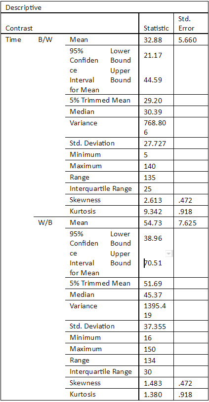

###__Box-plot of reverse contrasts and their data spread for time/duration__  
####figure 2  
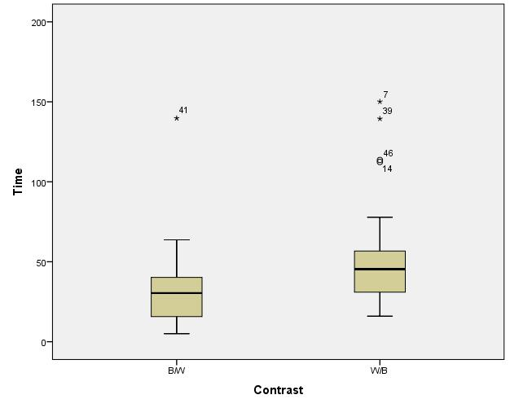

###__Histogram to show entire dataset distribution for time/duration__
####figure 3.
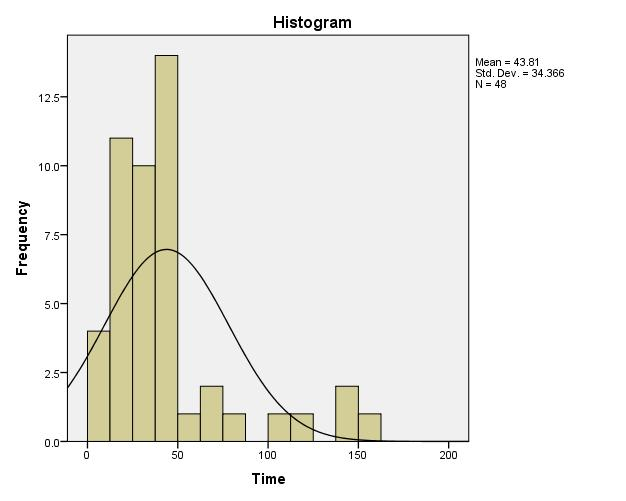  

##__Stage 1 Summary__  
A first look at the data immediately tells us that there is some 
difference in the spread for scanning times between Black text on 
white background (B/W)  and “White text on black background” (W/B). 
In figure 1 and 2 we can see that on averages people did better with 
B/W but whether this is a statistically significant and not random 
requires further testing. 
The type of test required for the hypothesis “Is there a significant 
difference in scan-reading time between articles with B/W and W/B 
contrast?” is a One-way ANOVA or single factor ANOVA test. However 
according to SPSS ANOVA guidelines  there is an assumption that
data needs to be approximately normally distributed. Looking at 
figure 3 we can see that the entire dataset is positively skewed 
which therefore requires us to conduct a test of normality 
(covered in the next section) to make sure it is normally 
distributed enough for an ANOVA test. Another assumption for an 
ANOVA test is that there are no outliers in the data. According 
to figure 2, there are a few outliers on both datasets. The last 
assumption is the variances of both B/W and W/B being homogenous.

###__Data normality testing__
####figure 4.
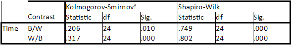  

###__a. Lilliefors Significance Correction__  
####figure 5.  
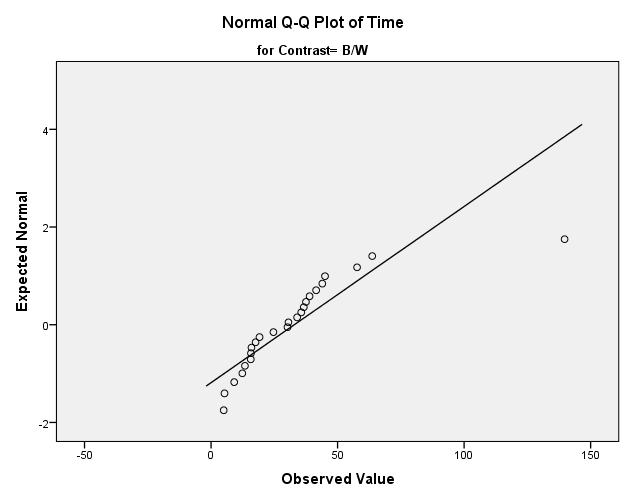 

####figure 6.  
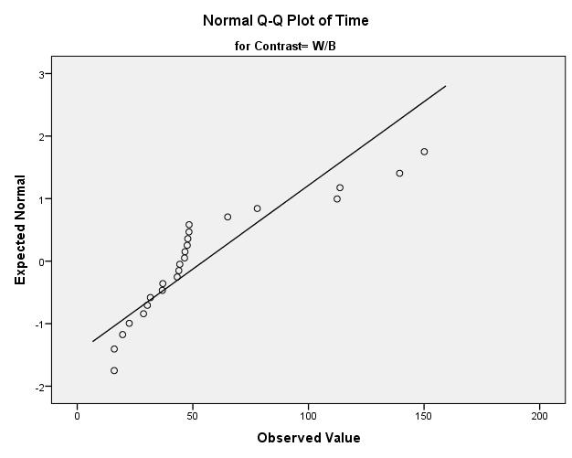  

##__Stage 2 - Summary of normality testing__  
According to figure 4 results, the data set is not normally 
distributed. The sig value is quite a bit under 0.05 which 
tells us to reject the hypothesis that the data is normally 
distributed. This is further shown by the normal Q-Q plots for 
the reverse contrasts as the plots are quite a distance from the 
regression lines which indicates the data is not normal. This 
means that we cannot conduct an ANOVA test without transforming 
the data to be normalized in which we will discuss in the next 
section.  

###__Data transformation__  
We decided that normalizing the entire time variable would fix both 
the skewness value in the data set as well as the kurtosis value 
(outliers). Using the rank cases facility within SPSS with the 
‘Fractional Rank’ option ticked created a new variable which made 
the highest time/duration at 1.0 and then the rest of the 
times/duration ranked. 
Then using this ranked time variable and the idf.normal 
function() within ‘Compute variables’ in ‘Transform’ drop 
down to then generate a normalized time variable. Some 
descriptive statistics for the new normalized data set is 
shown in the next section.  

###__Descriptive statistics of transformed data__  
####figure 7.  
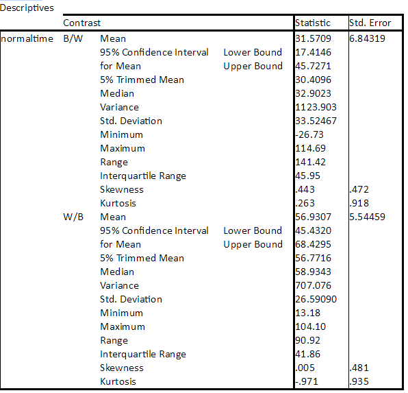  

####figure 8.  
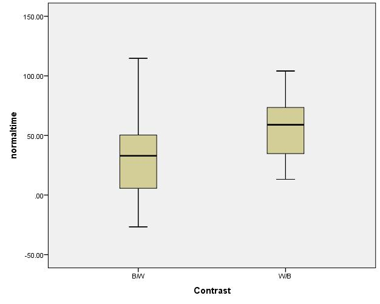  

###__Data distribution__  
####figure 9.  
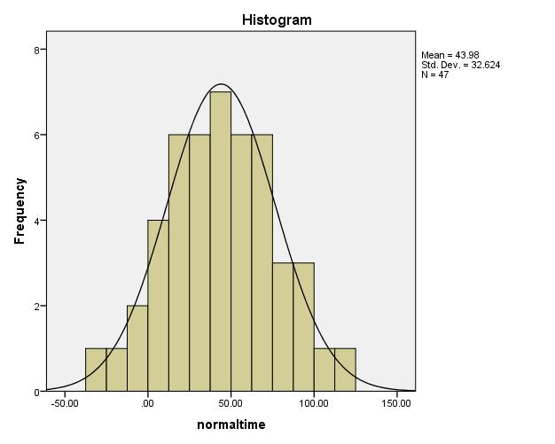  

###__Data normality testing__
####figure 10.
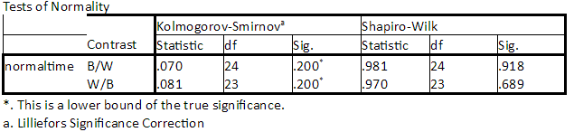  

####figure 11.  
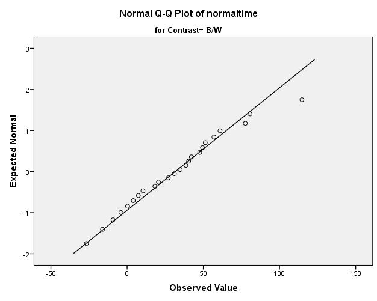  

###__Levenes test of Homogeneity__  
####figure 12.  
  

####figure 13.
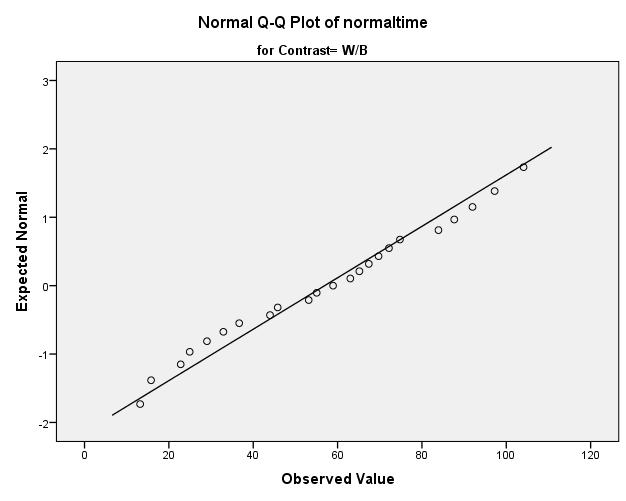  

##__Stage 3 - Normalizing the data set__
As you can see normalizing the data set had the desired effect. According 
to figure 7, the skewness and kurtosis values has been reduced considerably.
The outliers issue in the data set have been removed shown in figure 8 
and figure 9 shows the data in a histogram in which the data set appears  
normally distributed.
To confirm this further we conducted a normality test (figure 10, 11 and 13)
 on the normalized variable which shows both B/W and W/B Sig values are way
 over 0.05 which means we can accept the hypothesis that the data set is 
 normally distributed. Figures 11 and 13 show that the data is quite close 
 to the regression line on the Q-Q plot for both contrast’s which indicates 
 the data is normal.
Another requirement for ANOVA is variance homogeneity of which we undertook 
a Levene test with the data set (figure 12). The test shows that the variances 
between both contrasts are indeed homogeneous with a Sig value way over .005. 
The data is now ready for a one-way ANOVA test which we will compare the means 
for both B/W and W/B to see whether they are statistically significant.  

###__One-way ANOVA Test (Single-factor ANOVA__  
####figure 14.  
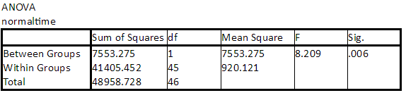  
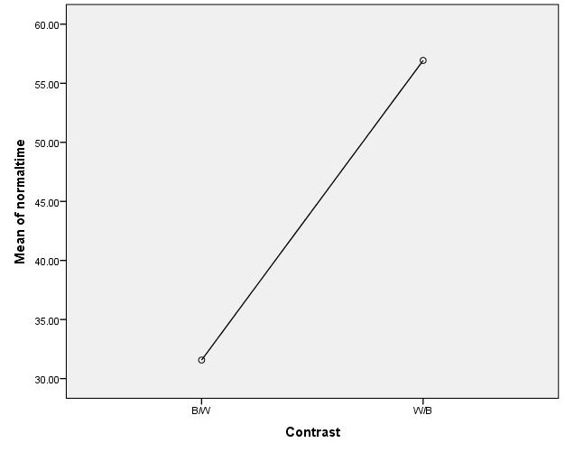  

####figure 16.  
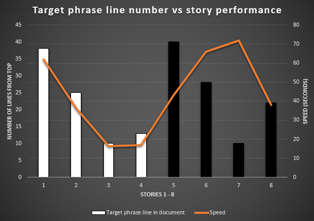 

##__Stage 4 - Discussion of One-way ANOVA results__  
At first glance we can see the Sig value (p-value) for the One-way ANOVA test 
(figure 14) is below 0.05 which means we can reject the null hypothesis that 
the differences in the means is not statistically significant. 
In our study there appears to be a statistically significant difference in 
scan-reading performance between B/W and W/B articles. Further feedback from 
the students we were sampling found the black and white articles easier to 
search through besides Sonic who stated he developed software in IDE with dark 
backgrounds.
This, however does not disprove previous findings in research we used to test 
this hypothesis. For one our study did not take into account the line at which 
the target phrase in the articles is situated. A little bit of extra 
explorative analysis at the data (figure 16)  shows that scan-reading 
performance lines up almost perfectly with the B/W - and there being decreases 
in W/B. As a result of the random placement of target phrase - the W/B articles 
had the target phrase situated mostly between 20 - 45. The one discrepancy is 
article 7 which on average took a lot longer for students to search through 
even though the target phrase was on line 10. The phrase, however, was on 
the end of line 10 meaning the rest of the phrase was on line 11 which means 
the entire phrase was only in view by reading each line to line rather than 
scan-reading the document. I may also emphasize that the sample population was 
very small (6 students). The sample may data may not therefore reflect reality.
This shows an error in our experiment design of looking at the one factor 
(contrast) that there could very well be the position factor having a 
considerable effect on scan reading speed. We did not take measures to i
solate the target phrase position variable and for a larger sample of 
students to take the test. Future experiment design around this area of 
research would need to take these details into account.
 

